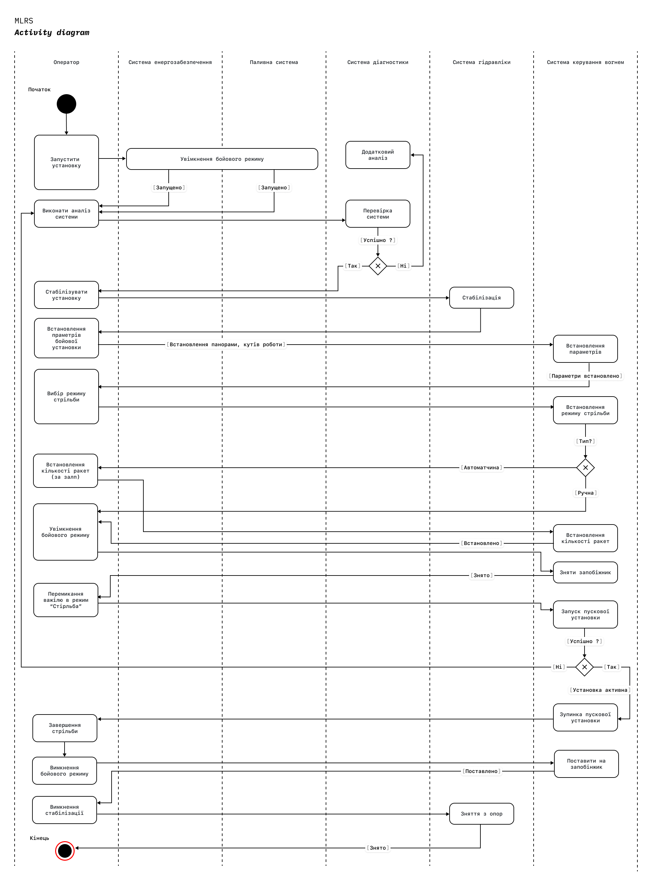

# Система - РСЗВ

За основу взято систему українського походження - БМ21У “Верба” 

## Підсистеми

Розбиття системи на функціональні підсистеми

- Система керування вогнем
	- Дозволяє операторам визначати визначення куту запуску ракет, запускати ракети, зупиняти пуск, коригувати, за потреби. 
	- Інтеграція з системами навігації та координації вогню
	- Забезпечення активного коригування вогнем використовуючи дані зовнішніх джерел

- Система балістичних розрахунків
	- Розрахунок параметрів наведення (кут, швидкість ракет, корекція з огляду на погодні умови, рельєф та висоту над рівнем моря)
	- Інтегрування геопросторової системи для симуляції траєкторії політу ракет 

- Система безпеки
	- Забезпечення захисту екіпажу від біологічних, хімічних та радіаційних загроз
	- Інтеграція систем активного та пасивного захисту
	- Моніторинг навколишнього середовища на предмет загроз
	- Забезпечення захисту від дронів (реб)

- Гідравлічна система
	- Забезпечення надійного підйому та спуску (з опор) установки. 
	- Амортизація установки.
	- Автоматизація процесу стабілізації та горизонтування установки

- Паливна система
	- Безпечне зберігання палива
	- Забезпечення подачі палива до двигунів системи
	- Контроль витрат палива, моніторинг рівня палива

- Система транспортування
	- Забезпечення мобільності системи по різних типах місцевості
	- Підтримка стабільного положення системи
	- Захист від перенавантажень під час руху та пуску ракет

- Система звʼязку та навігації
	- Забезпечення звʼязку між операторами установки з командним пунктом (командиром батареї)
	- Інтеграція з суміжними пусковими
	- Забезпечення захисту комунікацій
	- Визначення географічного положення установки
	- Інтеграція з системами GPS та координування

- Система електроживлення
	- Забезпечення незалежного живлення усіх систем установки
	- Керування розподілом енергії між підсистемами
	- Аварійне відключення живлення при детектуванні збоїв

- Контрольно-діагностична система
	- Моніторинг стану всіх підсистем РСЗВ
	- Діагностика збоїв та виявлення несправностей
	- Монітринг стану ракет та пускової установки 
	- Ведення журналу подій системи (аля логування подій системи) 

##  Structure Diagram

## Requirements Diagram

## Use Case

## State Diagram

Main diagram

Power diagram

FireControl System

Defence

Fuel system

## Sequences diagram

## Activity diagram

## Python Implementation

Швидкій перехід
- [Стартовий файл](src/main.py)
- [Клас шасі та повʼязаного](src/Vehicle.py)
- [Клас контролю вогню](src/FireControl.py)
- [Клас оператора](src/Operator.py)
- [Клас ракет](src/Missile.py)
- [Клас журналу подій](src/EventLog.py)

Приклад запуску

Логування цих самих дій

